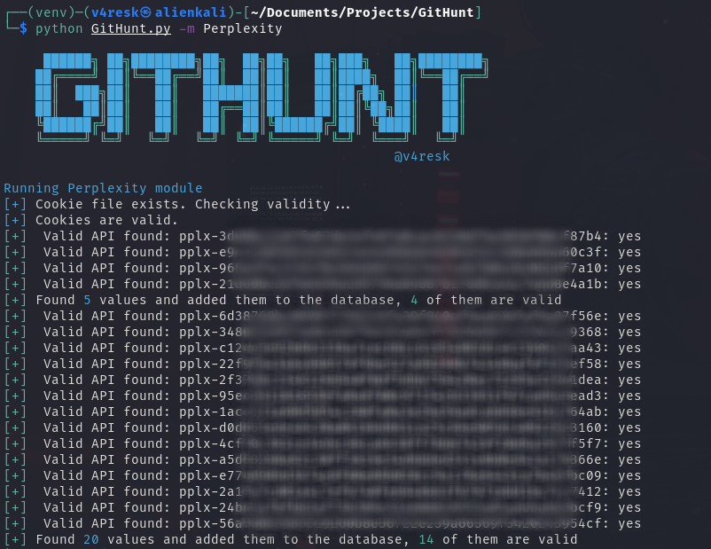

# GitHunt

<p align="center">
 
</p>
GitHunt is a Python tool for detecting sensitive data exposure in GitHub repositories. Leveraging GitHub's powerful search functionality, it scans for private keys, credentials, authentication tokens, API keys, and more.  

THIS PROJECT IS ONLY FOR ***SECURITY RESEARCH*** AND REMINDS OTHERS TO PROTECT THEIR PROPERTY, DO NOT USE IT ILLEGALLY!!
The project authors are not responsible for any consequences resulting from misuse.


## Installation 

Clone repo and install dependencies
```bash
git clone https://github.com/v4resk/GitHunt && cd GPTHunter
python3 -m virtualenv venv && source venv/bin/activate
pip3 install -r requirements.txt
```

## Usage



## Modules

GitHunt use "modules" that define targets for the hunting sessions. Below is the list of currently implemented ones

| **Name** | **Description** |
|------|------|
|   OpenAI  | Hunt for OpenAI API Keys     |
|   Perplexity  | Hunt for Perplexity API Keys     |

# FAQ

**Q: Why use GitHub's web-based search rather than the GitHub Search API?**

A: The official GitHub search API does not support regex search. Only web-based search does.

**Q: Why are you limiting the programming language in the search instead of searching all languages?**

A: The web-based search only provides the first 5 pages of results. There are many API keys available. By limiting the language, we can break down the search results and obtain more keys.

**Q: Why don't you use multithreading?**

A: Because GitHub searches and OpenAI are rate-limited. Using multithreading does not significantly increase efficiency.


## References
GitHunt was largely inspired by [ChatGPT-API-Leakage](https://github.com/Junyi-99/ChatGPT-API-Leakage/tree/main) and projects [Github Dorks](https://github.com/techgaun/github-dorks).
