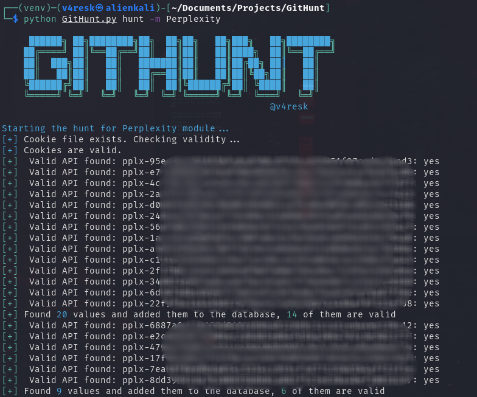

# GitHunt

<p align="center">
 
</p>
GitHunt is a Python tool for detecting sensitive data exposure in GitHub repositories. Leveraging GitHub's powerful search functionality, it scans for private keys, credentials, authentication tokens, API keys, and more.  

THIS PROJECT IS ONLY FOR ***SECURITY RESEARCH*** AND REMINDS OTHERS TO PROTECT THEIR PROPERTY, DO NOT USE IT ILLEGALLY!!
The project authors are not responsible for any consequences resulting from misuse.


## Installation 

Clone repo and install dependencies
```bash
git clone https://github.com/v4resk/GitHunt && cd GitHunt
python3 -m virtualenv venv && source venv/bin/activate
pip3 install -r requirements.txt
```

## Usage
```bash
# Hunt mode: see available modules
python GitHunt.py hunt -h

# Hunt mode: use OpenAI module
python GitHunt.py hunt -m OpenAI

# Export mode: see available modules and options
python GitHunt.py db -h

# Export mode: export valid OpenAI keys in json
python GitHunt.py db -m OpenAI -f json -o ~/export.json

# Export mode: get valid OpenAI keys in grepable text format
python GitHunt.py db -m OpenAI -f txt

# Export mode, get all OpenAI Keys 
python GitHunt.py db -m OpenAI -f csv -o ~/export.json --all
```

## Demo




## Modules

GitHunt uses “modules” to define targets for hunting sessions. Here is a list of the modules currently implemented.

| **Name** | **Description** |
|------|------|
|   OpenAI  | Hunt for OpenAI API Keys     |
|   Perplexity  | Hunt for Perplexity API Keys     |

# FAQ

**Q: Why use GitHub's web-based search rather than the GitHub Search API?**

A: The official GitHub search API does not support regex search. Only web-based search does.

**Q: Why are you limiting the programming language in the search instead of searching all languages?**

A: The web-based search only provides the first 5 pages of results. There are many API keys available. By limiting the language, we can break down the search results and obtain more keys.

**Q: Why don't you use multithreading?**

A: Because GitHub searches and OpenAI are rate-limited. Using multithreading does not significantly increase efficiency.


## References
GitHunt was largely inspired by [ChatGPT-API-Leakage](https://github.com/Junyi-99/ChatGPT-API-Leakage/tree/main) and projects [Github Dorks](https://github.com/techgaun/github-dorks).
